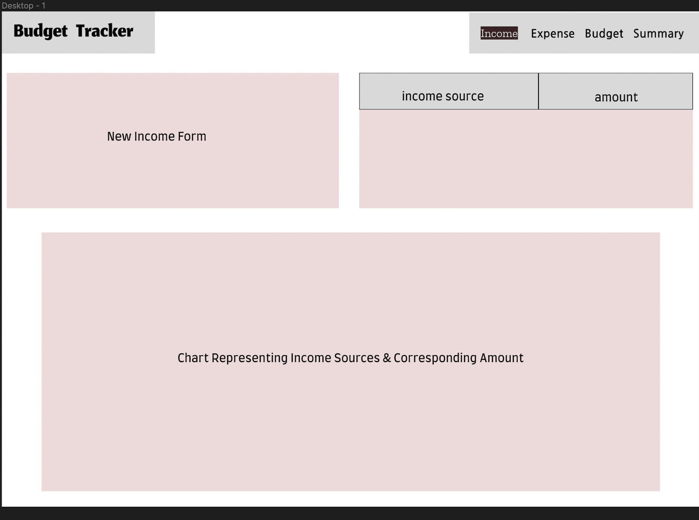
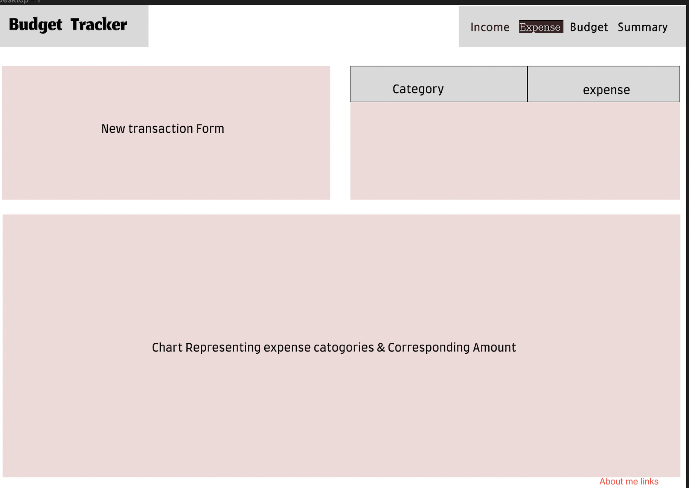
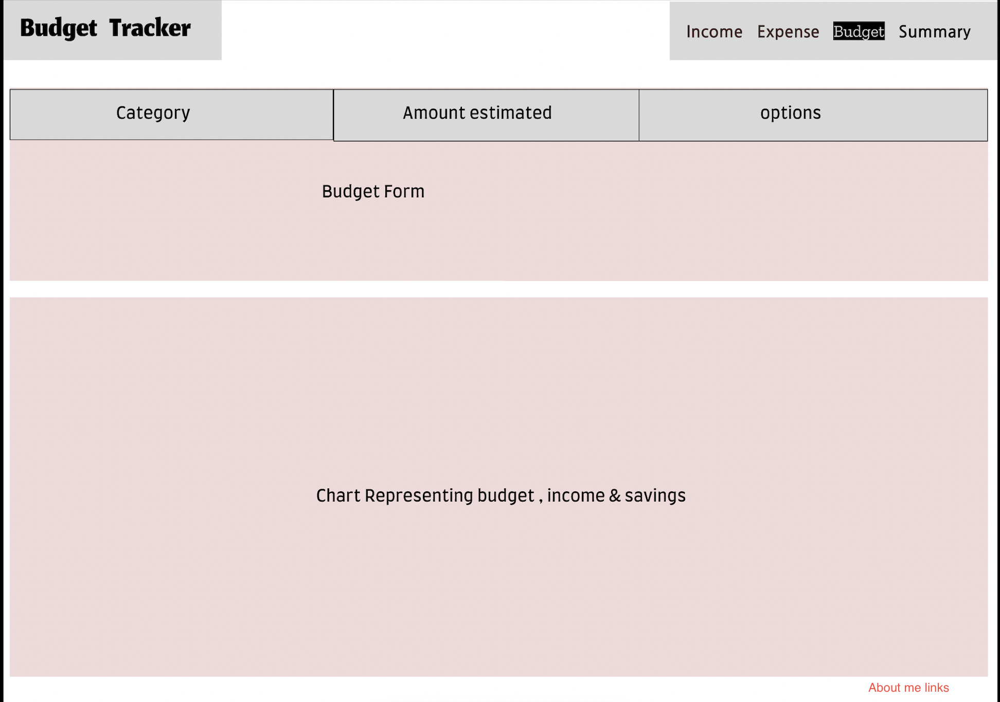
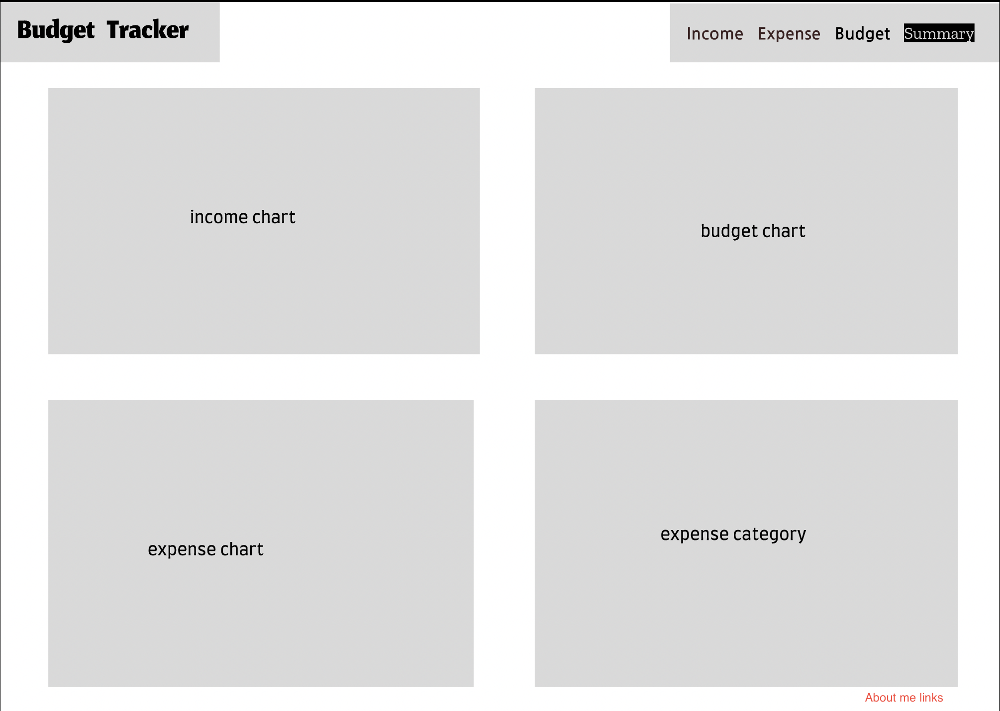

# budget-tracker_javascript_project
The budget tracker is a web-based application designed to help users track and manage their personal finances effectively. The application aims to provide a user-friendly interface for users to input and categorize their expenses, set budgets, and visualize their financial data through interactive charts. By offering comprehensive financial insights, the budget tracker will empower users to make informed financial decisions and achieve their financial goals.

Functionality & MVPs:
In the budget tracker, users will be able to:

-Expense Tracking: Add, edit, and delete expenses with details like category and amount

-Budget Management: Set budgets for different expense categories.

-Interactive Charts: Generate dynamic charts and graphs to visualize spending patterns and budget progress.

-Data Persistence: Utilize cookies to store user expenses, budgets, and settings for seamless data retrieval.

Technologies, Libraries, APIs:
The budget tracker will use the following technologies and libraries:

-Frontend: HTML, CSS, JavaScript, Chart.js for data visualization.
-Backend: No backend is used for this project as data will be stored in cookies.

Implementation Timeline:
-Friday Afternoon & Weekend: Implement the core HTML structure and CSS styles for the frontend.

-Monday: Develop the expense tracking functionality, allowing users to add, edit, and delete expenses.

-Tuesday: Add budget management features, including setting budgets for different expense categories.

-Wednesday: Finalize data visualization with interactive charts and graphs.Test the application for responsiveness and make necessary adjustments.

-Thursday Morning: Perform comprehensive testing and debugging.   Polish the user interface and add any finishing touches.

Link to live version of the project provided.

Wireframes:
https://www.figma.com/proto/UCIlKgc3ECNvGolZtJMHBf/Untitled?type=design&node-id=1-2&t=tK1JfkUUE3dS3den-1&scaling=scale-down&page-id=0%3A1&mode=design

