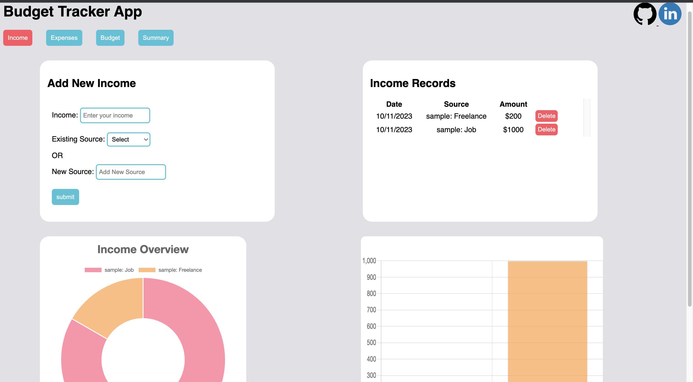

# budget-tracker_javascript_project
The budget tracker is a web-based application designed to help users track and manage their personal finances effectively. The application aims to provide a user-friendly interface for users to input and categorize their expenses, set budgets, and visualize their financial data through interactive charts. By offering comprehensive financial insights, the budget tracker will empower users to make informed financial decisions and achieve their financial goals.

## Live
Visit the app: [Budget Tracker](https://eliltaa.github.io/budget-tracker_javascript_project/)

## Features

- **Income Tracking**: Keep a record of your income sources, including date, source, and amount.
        

- **Expense Tracking**: Record your expenses with details such as the date, category, and amount.
        

- **Budget Planning**: Set your budget and visualize your spending relative to your budget.
        

- **Interactive Charts**: Visualize your financial data with interactive and informative charts.

- **Data Persistence**: Your financial data is saved in cookies, so you won't lose your records when you revisit the site.

Technologies, Libraries:
- Frontend: HTML, CSS, JavaScript, Chart.js for data visualization.
- Backend: No backend is used for this project as data will be stored in cookies.